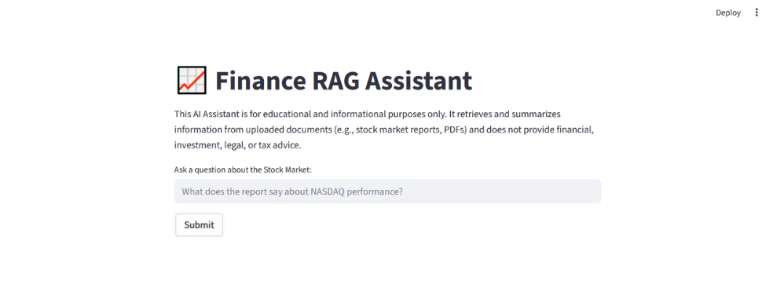
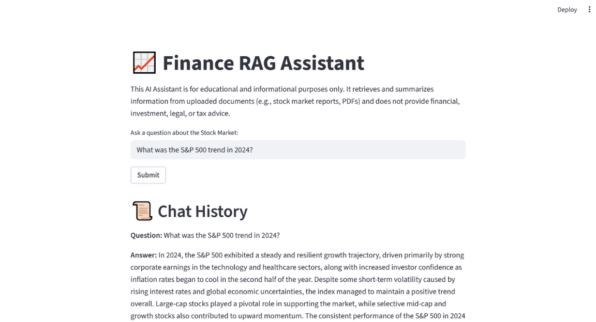

# Finance RAG Assistant

An intelligent Stock Market AI Agent that answers questions about stock market performance in 2024. The agent uses a PDF document as its knowledge base and allows users to query it interactively via a Streamlit web interface. It leverages retrieval augmented generation with OpenAI embeddings to provide accurate, document-based responses in real-time.

---

## Project Images





---

## Technologies

```Python```  ```Streamlit```  ```ChromaDB``` ```OpenAI```  ```LangGraph```  

---

## Technical Working

1. **PDF Loading & Chunking**
   - The stock market report is loaded using `PyPDFLoader`.
   - Text is split into manageable chunks using `RecursiveCharacterTextSplitter` for better retrieval performance.

2. **Vector Database & Embeddings**
   - Chroma is used to create a persistent vector store of document embeddings.
   - Embeddings are generated with `OpenAIEmbeddings` to capture semantic meaning.

3. **Retriever Tool**
   - A custom tool `retriever_tool` searches the vector store to find the most relevant document chunks.
   - Returns the content in a formatted structure for reference by the LLM.

4. **LLM Integration**
   - `ChatOpenAI` is used to process user queries and reason over retrieved document information.
   - The system prompt instructs the LLM to cite document sections when answering.

5. **Agent Architecture**
   - Implemented using LangGraph:
     - LLM node generates responses.
     - Retriever node executes tool calls if needed.
     - Conditional looping allows multiple retrieval calls until the question is fully answered.

6. **Streamlit Frontend**
   - Users interact with the agent via a simple web interface.
   - Features include:
     - Text input for user questions.
     - Real-time responses from the AI agent.
     - Chat history display with question-answer pairs.
   - Session state ensures conversation continuity during the session.

7. **Error Handling & Safety**
   - Checks for missing PDF files and tool call errors.
   - Provides informative messages if no relevant data is found in the document.

---

## Running the Project

1. Clone the repository:
   ```bash
   git clone https://github.com/ssharpalla2002/AI_Agent.git
   ```

2. Create and activate a Python virtual environment:
   ```bash
   python -m venv venv
   source venv/bin/activate  
   ```

3. Install dependencies:
   ```bash
   pip install -r requirements.txt
   ```

4. Place the stock market PDF in the `data/` folder.

5. Run the Streamlit app:
   ```bash
   streamlit run app.py
   ```

6. Open the application in your browser:
   ```
   http://localhost:8501
   ```

